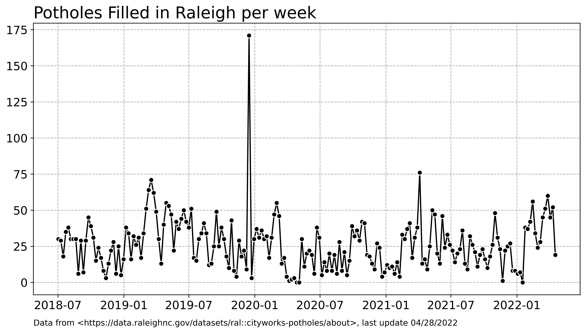

### Hi there 👋

My name is Andy Wheeler. Currently a private sector data scientist working with health insurance claims (mostly statistical models to identify problematic health claims). Formerly though I was an academic (PhD in criminal justice), and [I mostly worked with police departments to evaluate crime reduction initiatives, and improve the efficiency and fairness of different predictive policing systems](https://scholar.google.com/citations?user=iNNqtgwAAAAJ&hl=en). I often [blog on various data science/statistic projects](https://andrewpwheeler.com/) (in quite a few different languages). 

You can reach me at apwheele@gmail.com, or check out my consulting services at [**CRIME** De-Coder](https://crimede-coder.com/).

Always feel free to reach out with questions!

Automated chart creation using Github Actions :

<!--
**apwheele/apwheele** is a ✨ _special_ ✨ repository because its `README.md` (this file) appears on your GitHub profile.

Here are some ideas to get you started:

- 🔭 I’m currently working on ...
- 🌱 I’m currently learning ...
- 👯 I’m looking to collaborate on ...
- 🤔 I’m looking for help with ...
- 💬 Ask me about ...
- 📫 How to reach me: ...
- 😄 Pronouns: ...
- ⚡ Fun fact: ...
-->
